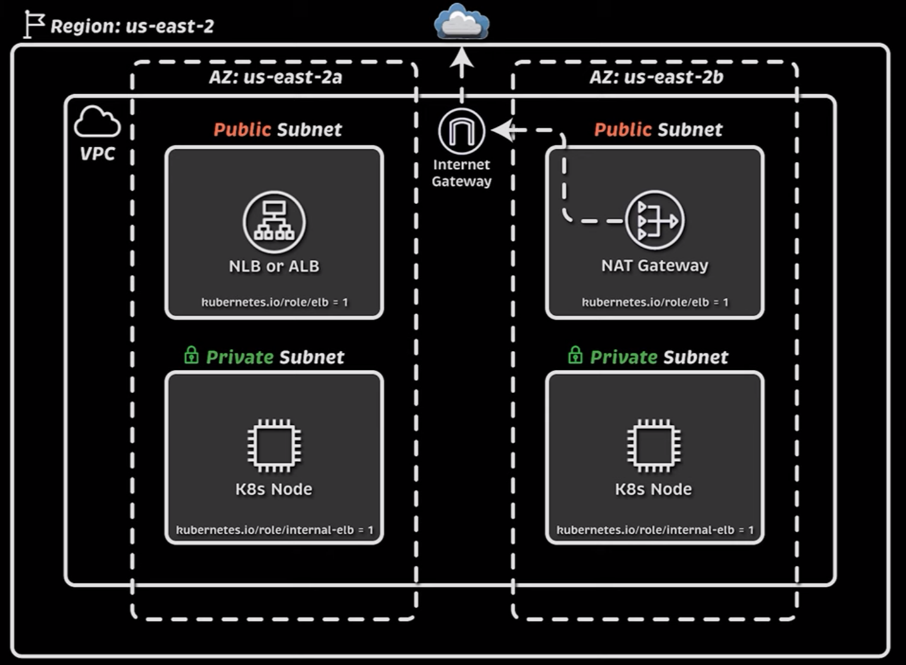
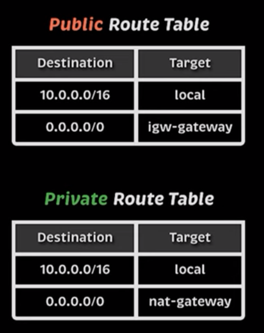

# Start by creating the VPC network along with network components

An EKS Cluster consists, in terms of network infrastructure, of:

-> A VPC network within a specific region, then a bunch of subnets
-> Basically, we need two types of subnets for our cluster, the first is a private subnet and the other one is public.
-> The private subnet is the one where cluster nodes will be provisioned, nodes should not be accessible from the public internet.
-> The public subnet will host our LB (ALB or NLB). The LB should be able to route traffic from and to the public internet.
-> We will have 2 public subnets and 2 private ones distributed across 2-AZs ( "one private and one public" across each AZ).
-> We need an IGW so we can route traffic from public subnets to internet. Note that an IGW is associated to a VPC but not specific subnets. 
-> To make our public subnets 'PUBLIC' we need to create public route tables that have the IGW as target (destination:0.0.0.0/0 --> igw)
-> We also want to be able to pull docker images from registries so we need to be able to send outbuond traffic from our worker nodes, and to make that possible we will need a private route table that routes external traffic to the NAT Gateway which is itself will redirect it to the IGW created previously.

